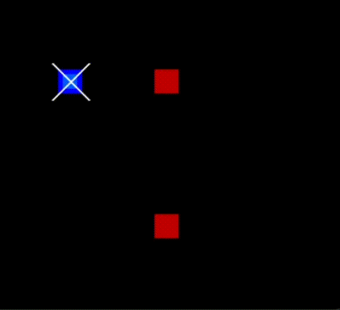
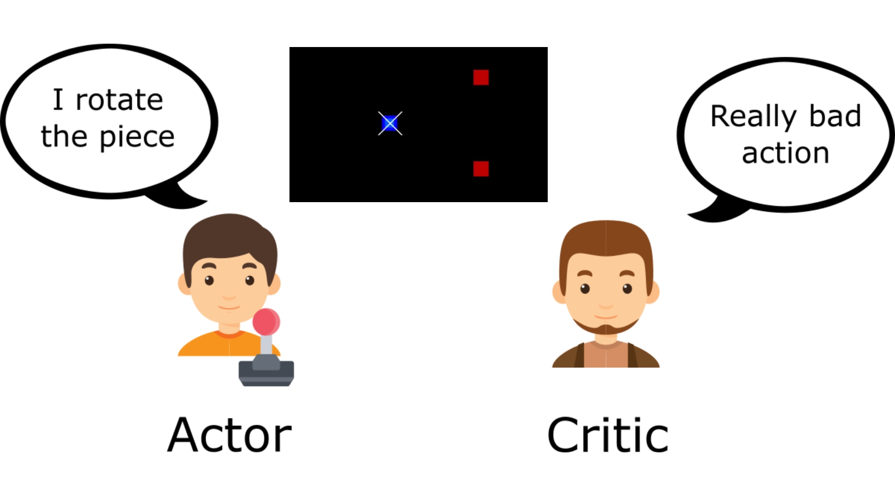

# 2D Drone Gate Navigation (Scratch RL Implementation)



---

## Table of Contents

- [2D Drone Gate Navigation (Scratch RL Implementation)](#2d-drone-gate-navigation-scratch-rl-implementation)
  - [Table of Contents](#table-of-contents)
  - [Overview](#overview)
    - [Key Features](#key-features)
  - [Advantage Actor-Critic (A2C) Algorithm](#advantage-actor-critic-a2c-algorithm)
  - [Environment Details](#environment-details)
    - [Observations](#observations)
    - [Actions](#actions)
    - [Reward Function](#reward-function)
  - [Project Structure](#project-structure)
  - [Installation](#installation)
  - [Usage](#usage)
  - [Contributing](#contributing)
  - [License](#license)

---

## Overview

This project implements a **2D drone gate navigation system** using **reinforcement learning (RL) from scratch**. Unlike many RL projects that use pre-built libraries such as **Stable-Baselines3** or **RLlib**, this project is entirely built from scratch, using only **PyTorch** to define the neural networks.

By implementing RL from scratch, this project provides a deeper understanding of:
- **Policy gradient methods**
- **Advantage estimation (A2C)**
- **Training loop structure**
- **Reward shaping for real-time environments**

The objective is to train a quadrotor to successfully navigate through gates using **position-based observations** and a set of **discrete actions**.

### Key Features

- **Scratch RL Implementation:** No external RL libraries, just PyTorch.
- **Deep Reinforcement Learning (DRL):** Implements the **Advantage Actor-Critic (A2C) algorithm** from scratch.
- **2D Simulation:** Built with **PyGame**, enabling real-time visualization.
- **Custom Reward Function:** Designed for efficient gate navigation.
- **Custom Observation Space:** Provides relevant state information for optimal learning.

---

## Advantage Actor-Critic (A2C) Algorithm

A2C is a policy gradient method that uses an **actor-network** to decide actions and a **critic-network** to evaluate the chosen actions. The critic helps reduce variance in policy updates, making learning more stable.

- **Actor:** Learns to take actions based on observations.
- **Critic:** Evaluates the action taken and provides a learning signal.
- **Advantage:** Helps the network understand whether an action is better or worse than expected.



---

## Environment Details

### Observations

The quadrotor receives the following state information at each step:

1. **Quadrotor Position**:
   - `x`: The horizontal position of the quadrotor.
   - `y`: The vertical position of the quadrotor.

2. **Quadrotor Direction**:
   - `direction`: The current orientation of the quadrotor, represented as an integer:
     - `0`: Right
     - `1`: Down
     - `2`: Left
     - `3`: Up

3. **Previous Quadrotor Position**:
   - `prev_x`: The horizontal position of the quadrotor in the previous step.
   - `prev_y`: The vertical position of the quadrotor in the previous step.

4. **Relative Position to the Gate**:
   - `gate_x > quad_x`: `1` if the gate is to the right of the quadrotor, otherwise `0`.
   - `gate_x < quad_x`: `1` if the gate is to the left of the quadrotor, otherwise `0`.
   - `gate_y > quad_y`: `1` if the gate is below the quadrotor, otherwise `0`.
   - `gate_y < quad_y`: `1` if the gate is above the quadrotor, otherwise `0`.

---

### Actions

The agent can take one of the following **discrete actions**:
1. **Increase left rotor thrust**
2. **Increase right rotor thrust**
3. **Equal thrust (hovering)**

### Reward Function

The reward function encourages efficient gate navigation:
- **Positive Reward**: Given when the quadrotor successfully passes through a gate or moves toward it.
- **Negative Reward**: Assigned for collisions with obstacles or moving away from the gate.

---

## Project Structure

```plaintext
2d-drone-rl-navigation/
├── media/
│   ├── diagrams/
│   │  └── actor_critic_diagram.jpg
│   ├── gifs/
│   │  └── simulation_overview.gif
├── src/                  # Main scripts for training and testing
│   ├── train.py          # Training agent
│   ├── model.py          # Neural network definitions (Actor and Critic)
│   ├── environment/      # Environment, Reward function, Observations, and agent functions
│   ├── memory.py         # Step_Memory and Episode_Memory
│   ├── test.py           # Testing the trained model
├── Arial.tff             # pygame module for loading and rendering fonts
├── LICENSE
├── README.md
└── requirements.txt      # Dependencies            
```

---

## Installation

1. **Clone the Repository:**
   ```bash
   git clone https://github.com/Oneiben/2d-drone-rl-navigation.git
   cd 2d-drone-rl-navigation
   ```

2. **Create a Virtual Environment (Recommended):**
   ```bash
   python -m venv venv
   source venv/bin/activate  # On Linux/macOS
   venv\Scripts\activate    # On Windows
   ```

3. **Install Dependencies:**
   ```bash
   pip install -r requirements.txt
   ```

---

## Usage

1. **Train the reinforcement learning model:**
   ```bash
   python src/train.py
   ```

2. **Evaluate a trained model:**
   ```bash
   python src/test.py
   ```

---

## Contributing

Contributions are welcome! Follow these steps to contribute:

1. Fork the repository.
2. Create a new branch:
   ```bash
   git checkout -b feature-name
   ```
3. Make your changes and commit:
   ```bash
   git commit -m "Description of changes"
   ```
4. Push the changes and open a pull request.

---

## License

This project is licensed under the **MIT License**. See the [LICENSE](LICENSE) file for more details.

